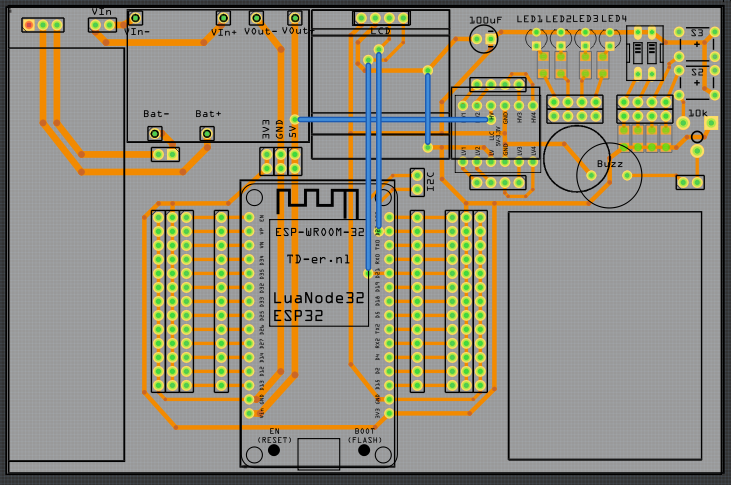
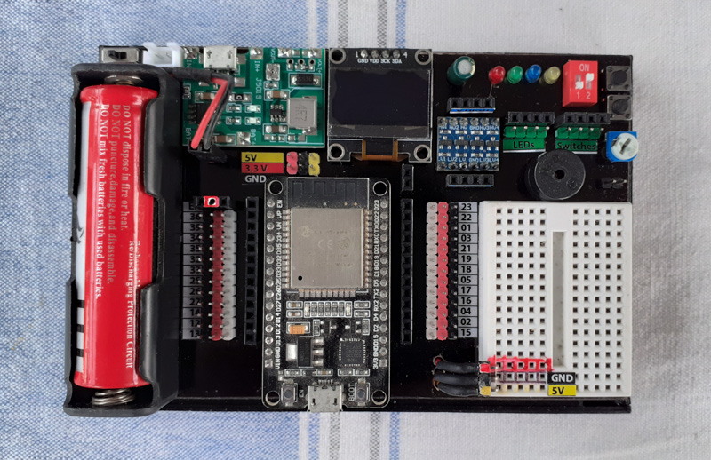
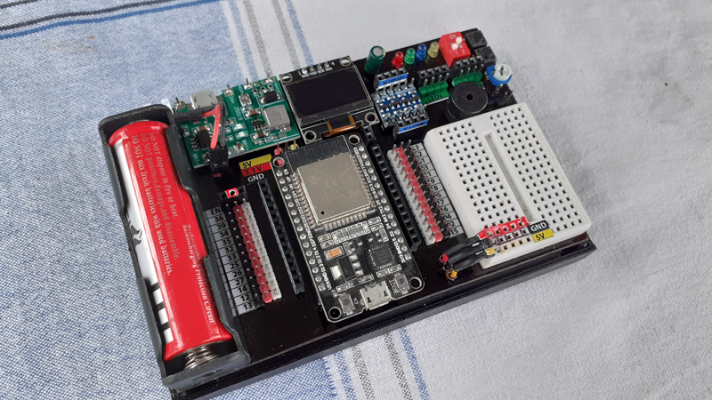

# ESP32 Development Kit

ESP32 is a powerful embedded development board. But the ESP32 DevKit design is not much breadboard friendly and has a weird pinout design.

That is why I designed this development kit, to make my experiments easier with the help of built-in electronic components and breadboard.

I decided to share it *open-source* under *Creative Commons Attribution-ShareAlike 4.0 International License*.

The stickers pasted to the board also uploaded for your reference. You can print the *prints/stickers.pdf* file to an A5 size sticker paper and cut them.

### Features

- Expanded GPIO pins with 3.3v and GND
- A tiny breadboard
- Li-ion battery
- USB charging controller
- Adjustable voltage booster (set to 5v)

- SSD1306 LCD module
- 3V3-5V logic level shifter (4 channels)

- 4 x LEDs (Red, Green, Blue, Yellow)
- 2 x DIP switches
- 2 x Pushbuttons
- 1 x Trimpot (10 kOhm)
- 1 x Active buzzer

## Schematics Diagram

You can find the schematics diagram from *v1_schematics.pdf*.

## PCB design

You can find the Gerber files of the design from the *v1_gerber* folder. This is a single side PCB, with 4 jumpers. PCB is designed using Fritzing.

## Final View

You can see some images of the final design (with the 3d printed enclosure) here.

## Sample Codes

I added a sample code for SSD1306 display, which is using Adafruit_SSD1306 library. I will try to add a few more libraries in future.

----
Shield: [![CC BY-SA 4.0][cc-by-sa-shield]][cc-by-sa]

This work is licensed under a
[Creative Commons Attribution-ShareAlike 4.0 International License][cc-by-sa].

[![CC BY-SA 4.0][cc-by-sa-image]][cc-by-sa]

[cc-by-sa]: http://creativecommons.org/licenses/by-sa/4.0/
[cc-by-sa-image]: https://licensebuttons.net/l/by-sa/4.0/88x31.png
[cc-by-sa-shield]: https://img.shields.io/badge/License-CC%20BY--SA%204.0-lightgrey.svg
